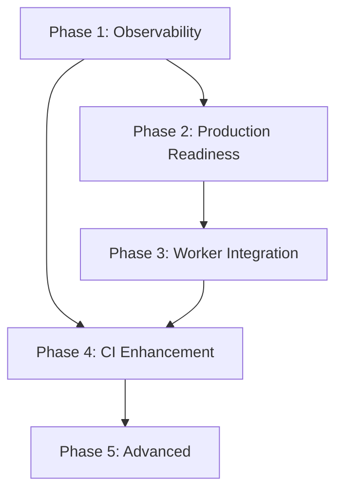

# Juniper Deploy Post-Release Development Roadmap

**Last Updated:** 2026-03-15
**Version:** 0.1.0
**Status:** DRAFT
**Owner:** Paul Calnon

---

## Overview

This roadmap captures the growth vectors identified during the juniper-deploy v0.1.0 post-release assessment. It covers observability hardening, production readiness improvements, worker service integration, CI enhancements, and advanced infrastructure features. Each phase is prioritized by operational impact and dependency ordering.

### Scope & Timeframe

- **Timeframe:** Q2 2026 -- Q4 2026 (Phases 1--4); Phase 5 deferred
- **Product area(s):** Docker Compose orchestration, observability stack, CI/CD pipelines, secrets management
- **Target version(s):** 0.2.0 -- 0.5.0

### Out of Scope

- Application-level code changes to juniper-data, juniper-cascor, or juniper-canopy (those repos own their own roadmaps)
- PyPI packaging or `juniper-ml` meta-package changes
- Cloud provider-specific deployment (AWS ECS, GCP Cloud Run, etc.)

---

## Goals

- **Operational visibility:** Pre-built Grafana dashboards and alerting rules for all Juniper services
- **Production hardening:** Resource limits, TLS termination, secrets management, and log rotation
- **Worker integration:** First-class support for juniper-cascor-worker in the compose stack
- **CI reliability:** Scheduled upstream breakage detection and container security scanning
- **Migration readiness:** Lay groundwork for eventual Kubernetes deployment

### Success Metrics

| Metric                          | Current     | Target   | Notes                                   |
| ------------------------------- | ----------- | -------- | --------------------------------------- |
| Grafana dashboards provisioned  | 0           | 3+       | CasCor, Data, Canopy                    |
| Alerting rules defined          | 0           | 5+       | Health, latency, error rate             |
| Services with resource limits   | 0/6         | 6/6      | All compose services                    |
| SOPS-encrypted secrets files    | 0           | 1+       | `.env.secrets` via existing `.sops.yaml`|
| CI scheduled test coverage      | None        | Weekly   | Detect upstream image/API breakage      |
| Worker service in compose       | Not present | Running  | With health check and scaling config    |

---

## Implementation Plan

- **Phase 1: Observability Hardening** -- Grafana dashboards, provisioning automation, alerting rules
- **Phase 2: Production Readiness** -- Resource limits, TLS, secrets management, log rotation
- **Phase 3: Worker Integration** -- juniper-cascor-worker service definition and networking
- **Phase 4: CI Enhancement** -- Scheduled tests, security scanning, compose validation on PR
- **Phase 5: Advanced (Deferred)** -- Kubernetes manifests, auto-scaling, blue-green deploys

---

## Milestones

| Milestone                    | Target Date | Version | Description                                         | Status     |
| ---------------------------- | ----------- | ------- | --------------------------------------------------- | ---------- |
| Observability Dashboards     | 2026-04-30  | 0.2.0   | Grafana dashboards for all three services            | Planned    |
| Alerting Rules               | 2026-05-15  | 0.2.0   | Prometheus alerting rules for health degradation     | Planned    |
| Production Compose Profile   | 2026-06-30  | 0.3.0   | Resource limits, restart policies, log rotation      | Planned    |
| TLS + Secrets                | 2026-07-31  | 0.3.0   | TLS termination and SOPS-based secrets               | Planned    |
| Worker Service               | 2026-08-31  | 0.4.0   | juniper-cascor-worker in docker-compose.yml          | Planned    |
| CI Hardening                 | 2026-09-30  | 0.5.0   | Scheduled tests, security scanning                   | Planned    |
| Kubernetes Readiness         | TBD         | TBD     | K8s manifests, auto-scaling, blue-green              | Deferred   |

---

## Phase Details

### Phase 1 -- Observability Hardening (HIGH)

**Priority:** P0
**Target version:** 0.2.0
**Depends on:** Existing observability profile, Prometheus scrape configs, Grafana provisioning directory

The observability profile (`--profile observability`) already provisions Prometheus and Grafana with a datasource and dashboard provider (`grafana/provisioning/`). This phase adds the actual dashboard content and alerting rules.

#### 1.1 Grafana Dashboard: CasCor Training Metrics

- **Type:** Feat
- Create `grafana/provisioning/dashboards/cascor-training.json`
- Panels: training epoch progress, loss curve, hidden unit additions, request latency histogram
- Datasource: Prometheus (auto-provisioned via `grafana/provisioning/datasources/prometheus.yml`)

#### 1.2 Grafana Dashboard: Data Service Throughput

- **Type:** Feat
- Create `grafana/provisioning/dashboards/data-service.json`
- Panels: dataset generation rate, request count by endpoint, response time percentiles, error rate
- Labels: filter by `service="juniper-data"` (matching `prometheus/prometheus.yml` labels)

#### 1.3 Grafana Dashboard: Canopy Request Rates

- **Type:** Feat
- Create `grafana/provisioning/dashboards/canopy-requests.json`
- Panels: HTTP request rate, WebSocket connection count, response codes, page load times

#### 1.4 Dashboard Provisioning Automation

- **Type:** Enhancement
- The dashboard provider in `grafana/provisioning/dashboards/dashboard-providers.yml` already watches the provisioning directory
- Verify that new JSON files are auto-loaded on Grafana startup (no manual import required)
- Add a `make obs-dashboards` target to validate dashboard JSON syntax before deploy
- Document dashboard development workflow in `docs/OBSERVABILITY_GUIDE.md`

#### 1.5 Alerting Rules

- **Type:** Feat
- Create `prometheus/alerts.yml` with recording and alerting rules
- Rules: service health endpoint down > 2 min, request error rate > 5%, P95 latency > 2s, container restart loop
- Wire into `prometheus/prometheus.yml` via `rule_files` directive
- Add Grafana alert contact point configuration to provisioning

---

### Phase 2 -- Production Readiness (MEDIUM)

**Priority:** P1
**Target version:** 0.3.0
**Depends on:** Phase 1 (observability provides visibility into resource usage)

#### 2.1 Production Docker Compose Profile

- **Type:** Enhancement
- Add `--profile production` to `docker-compose.yml` (or a `docker-compose.production.yml` override)
- Define per-service resource limits (`deploy.resources.limits` for CPU and memory)
- Configure restart policies (`restart: always` with `deploy.restart_policy`)
- Add log rotation via Docker logging driver options (`max-size`, `max-file`)

#### 2.2 TLS Termination

- **Type:** Feat
- Add a reverse proxy service (Traefik or Caddy) to the production profile
- Terminate TLS at the proxy; services communicate over plaintext on internal networks
- Support both self-signed certificates (development) and Let's Encrypt (production)
- Expose only ports 443 (HTTPS) and optionally 80 (redirect) on the host

#### 2.3 Secrets Management Completion

- **Type:** Enhancement
- `.sops.yaml` already exists with an age key for encrypting `.env` and `.env.secrets` files
- Create `.env.secrets.example` documenting all secret variables (API keys, Grafana admin password, Sentry DSNs)
- Add a `make secrets-encrypt` / `make secrets-decrypt` target wrapping `sops` commands
- Document the SOPS workflow in `docs/SECRETS_GUIDE.md`
- Ensure CI does not require decrypted secrets (use `${VAR:-}` defaults)

---

### Phase 3 -- Worker Integration (MEDIUM)

**Priority:** P1
**Target version:** 0.4.0
**Depends on:** juniper-cascor-worker having a published Docker image or Dockerfile

#### 3.1 Worker Service Definition

- **Type:** Feat
- Add `juniper-cascor-worker` service to `docker-compose.yml` under the `full` profile
- Build context: `../juniper-cascor-worker` (consistent with sibling service pattern)
- Environment variables: `CASCOR_SERVICE_URL`, `WORKER_ID`, `WORKER_LOG_LEVEL`

#### 3.2 Worker Networking

- **Type:** Feat
- Attach worker to the `backend` bridge network (same as `juniper-cascor`)
- Worker communicates with CasCor over the internal bridge; no host port exposure needed
- Add `depends_on: juniper-cascor: condition: service_healthy`

#### 3.3 Worker Health Check and Scaling

- **Type:** Feat
- Define a health check endpoint or process check for the worker
- Add `deploy.replicas` configuration for horizontal scaling (default: 1)
- Add `WORKER_REPLICAS` environment variable for easy override
- Document scaling instructions in `README.md`

---

### Phase 4 -- CI Enhancement (LOW)

**Priority:** P2
**Target version:** 0.5.0
**Depends on:** Phases 1--3 (tests should cover new services and profiles)

#### 4.1 Scheduled Weekly Integration Tests

- **Type:** Feat
- Add `schedule: cron: '0 6 * * 1'` trigger to `.github/workflows/ci.yml` (or a dedicated workflow)
- Run the full Docker integration suite weekly against `main` to detect upstream breakage
- Notify on failure via GitHub Actions notification (issue or Slack webhook)

#### 4.2 Container Image Security Scanning

- **Type:** Feat
- Add a `security-scan` job to the CI workflow using Trivy or Grype
- Scan all locally-built images after the `build` step
- Fail on critical/high severity CVEs; warn on medium
- Cache vulnerability database to reduce CI time

#### 4.3 Compose Config Validation on PR

- **Type:** Enhancement
- The `validate-compose` job already exists in `ci.yml` and validates `full`, `demo`, and `dev` profiles
- Extend to validate `observability` and `production` profiles as they are added
- Add JSON schema validation for Grafana dashboard files (Phase 1 output)

---

### Phase 5 -- Advanced (DEFERRED)

**Priority:** P3
**Target version:** TBD
**Depends on:** Phases 1--4 complete; operational experience with the Docker Compose deployment

These items are tracked for future consideration but are not scheduled.

#### 5.1 Kubernetes Deployment Manifests

- Helm chart or Kustomize overlays translating the Docker Compose topology to K8s
- Namespace isolation, ConfigMaps for environment, Secrets for credentials
- Service mesh integration (Istio or Linkerd) for observability and mTLS

#### 5.2 Auto-Scaling Worker Pools

- Horizontal Pod Autoscaler (HPA) for juniper-cascor-worker based on queue depth or CPU
- Requires metrics-server and a custom metrics adapter if using queue-based scaling

#### 5.3 Blue-Green Deployment Support

- Zero-downtime deployment strategy for CasCor and Data services
- Traffic splitting at the ingress controller level
- Automated rollback on health check failure

---

## Current Status of Features and Fixes

| Priority | Feature / Fix                                | Status   | Phase | Target Version |
| -------- | -------------------------------------------- | -------- | ----- | -------------- |
| **P0**   | CasCor training Grafana dashboard            | Planned  | 1     | 0.2.0          |
| **P0**   | Data service throughput Grafana dashboard     | Planned  | 1     | 0.2.0          |
| **P0**   | Canopy request rates Grafana dashboard        | Planned  | 1     | 0.2.0          |
| **P0**   | Dashboard provisioning automation             | Planned  | 1     | 0.2.0          |
| **P0**   | Prometheus alerting rules                     | Planned  | 1     | 0.2.0          |
| **P1**   | Production compose profile (resource limits)  | Planned  | 2     | 0.3.0          |
| **P1**   | TLS termination via reverse proxy             | Planned  | 2     | 0.3.0          |
| **P1**   | SOPS secrets management completion            | Planned  | 2     | 0.3.0          |
| **P1**   | juniper-cascor-worker service definition      | Planned  | 3     | 0.4.0          |
| **P1**   | Worker networking on backend bridge           | Planned  | 3     | 0.4.0          |
| **P1**   | Worker health check and scaling config        | Planned  | 3     | 0.4.0          |
| **P2**   | Scheduled weekly integration tests            | Planned  | 4     | 0.5.0          |
| **P2**   | Container image security scanning             | Planned  | 4     | 0.5.0          |
| **P2**   | Extended compose validation on PR             | Planned  | 4     | 0.5.0          |
| **P3**   | Kubernetes deployment manifests               | Deferred | 5     | TBD            |
| **P3**   | Auto-scaling worker pools                     | Deferred | 5     | TBD            |
| **P3**   | Blue-green deployment support                 | Deferred | 5     | TBD            |

### Status Legend

| Icon / Label | Status      | Description                                |
| ------------ | ----------- | ------------------------------------------ |
| Done         | Done        | Implemented, tested, and released          |
| In Progress  | In Progress | Currently being worked on                  |
| Planned      | Planned     | Scheduled for future implementation        |
| Deferred     | Deferred    | Postponed to a later phase or version      |
| Cancelled    | Cancelled   | No longer planned                          |

### Priority Legend

- **P0 (Phase 1):** High -- Observability hardening, immediate operational value
- **P1 (Phases 2--3):** Medium -- Production readiness and worker integration
- **P2 (Phase 4):** Low -- CI enhancements for long-term reliability
- **P3 (Phase 5):** Deferred -- Advanced infrastructure, requires operational maturity

---

## Dependencies

| Dependent Item                    | Depends On                             | Type | Risk Level | Notes                                              |
| --------------------------------- | -------------------------------------- | ---- | ---------- | -------------------------------------------------- |
| Grafana dashboards (Phase 1)      | Services exposing `/metrics` endpoints | Tech | Low        | Metrics endpoints exist; need `METRICS_ENABLED=true`|
| Alerting rules (Phase 1)          | Dashboard metrics validated            | Tech | Low        | Define alerts after confirming available metrics    |
| Production profile (Phase 2)      | Phase 1 observability for validation   | Tech | Low        | Resource limits informed by observed usage          |
| TLS termination (Phase 2)         | Reverse proxy image selection          | Tech | Medium     | Traefik vs Caddy decision required                 |
| SOPS completion (Phase 2)         | age key already configured             | Tech | Low        | `.sops.yaml` exists with age key                   |
| Worker service (Phase 3)          | juniper-cascor-worker Dockerfile       | Tech | Medium     | Dockerfile must exist in sibling repo              |
| Scheduled CI tests (Phase 4)      | Phases 1--3 services defined           | Tech | Low        | Tests should cover all profiles                    |
| Security scanning (Phase 4)       | Built container images                 | Tech | Low        | Runs post-build in CI                              |
| Kubernetes manifests (Phase 5)    | Phases 1--4 complete                   | Tech | High       | Major architectural shift                          |

### Critical Dependencies

### Shared Dependencies

All phases share dependencies on:

- Docker Compose v2 with profile support
- Sibling repositories (juniper-data, juniper-cascor, juniper-canopy) maintaining stable Dockerfile and health endpoint contracts
- Prometheus metric exposition from application services (`METRICS_ENABLED=true`)

---

## Risks & Assumptions

### Risks

| Risk                                        | Impact | Likelihood | Mitigation                                       |
| ------------------------------------------- | ------ | ---------- | ------------------------------------------------ |
| Upstream service API/Dockerfile breakage     | High   | Medium     | Scheduled CI tests (Phase 4) for early detection |
| Metrics endpoint schema changes              | Medium | Low        | Pin dashboard queries to stable metric names     |
| juniper-cascor-worker Dockerfile not ready   | Medium | Medium     | Phase 3 can be deferred until worker repo ships  |
| TLS proxy adds latency/complexity            | Low    | Low        | Benchmark before and after; keep plaintext option|
| SOPS key rotation complexity                 | Low    | Low        | Document rotation procedure; keep backups        |

### Assumptions

- All three application services (juniper-data, juniper-cascor, juniper-canopy) already expose Prometheus-compatible `/metrics` endpoints when `METRICS_ENABLED=true`
- The `grafana/provisioning/dashboards/` directory is watched by the Grafana dashboard provider (confirmed in `dashboard-providers.yml`)
- juniper-cascor-worker will follow the same Dockerfile and health check conventions as other Juniper services
- Docker Compose `deploy` keys are available (requires Compose v2.x with `--compatibility` or Swarm mode for resource limits; alternatively use `mem_limit`/`cpus` top-level keys)

---

## References

- `docker-compose.yml` -- Current service definitions and profiles
- `prometheus/prometheus.yml` -- Prometheus scrape configuration
- `grafana/provisioning/dashboards/dashboard-providers.yml` -- Grafana auto-provisioning config
- `grafana/provisioning/datasources/prometheus.yml` -- Prometheus datasource for Grafana
- `.sops.yaml` -- SOPS encryption configuration (age key)
- `.github/workflows/ci.yml` -- Current CI pipeline
- `docs/OBSERVABILITY_GUIDE.md` -- Observability documentation
- `AGENTS.md` -- Project conventions and quick reference

---

## Change Log

| Date       | Version | Changes                                       | Author      |
| ---------- | ------- | --------------------------------------------- | ----------- |
| 2026-03-15 | 0.1.0   | Initial post-release development roadmap       | Paul Calnon |
