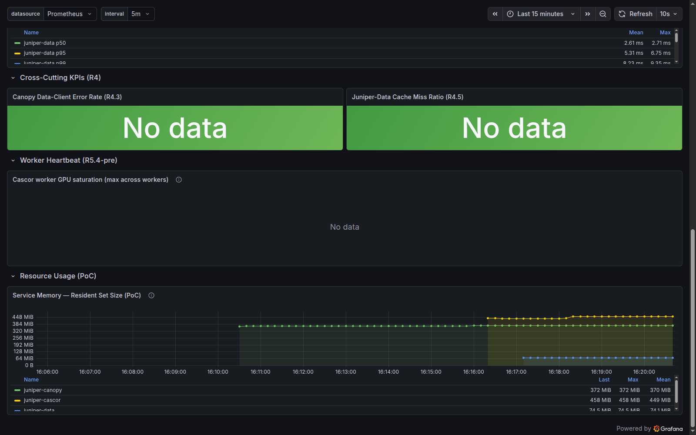

# Proof of Concept — Prometheus Query → Juniper Overview Dashboard

**Author**: Claude Code session, supervised by Paul Calnon
**Date**: 2026-05-27
**Stack**: docker-compose (full + observability profiles)
**Repository**: juniper-deploy
**Status**: Shipped end-to-end against the local docker-compose stack

---

## 1. Goal

Stand up a minimal but realistic Prometheus → Grafana flow against the running
docker-compose stack:

1. Pick a meaningful Juniper-platform metric.
2. Express it as PromQL.
3. Surface it as a new panel on the existing `juniper-overview` dashboard.
4. Capture every issue that blocked scrape success and fix or document it.

The deliverable is the new **Service Memory — Resident Set Size (PoC)** panel
appended to `grafana/provisioning/dashboards/juniper-overview.json`. See
[`screenshots/poc-panel-rendered.png`](screenshots/poc-panel-rendered.png) for
the rendered result with all three Juniper services reporting.

## 2. PromQL query

```promql
process_resident_memory_bytes{job=~"juniper-.*"}
```

Why this query:

| Property              | Reason                                                                 |
| --------------------- | ---------------------------------------------------------------------- |
| Cross-service         | The `{job=~"juniper-.*"}` matcher returns one series per Juniper app.  |
| Always available      | `prometheus_client` exports `process_resident_memory_bytes` for free.  |
| Useful operationally  | RSS by service answers "is anything bloating?" at a glance.            |
| No existing panel     | The dashboard had no resource-usage panel before.                      |
| Stable across restarts| The metric does not depend on any feature flag being toggled.          |

Sanity-check via the Prometheus HTTP API:

```bash
curl -s 'http://localhost:9090/api/v1/query?query=process_resident_memory_bytes%7Bjob%3D~%22juniper-.%2A%22%7D' \
  | python3 -c 'import json,sys; d=json.load(sys.stdin); [print(r["metric"]["job"], "=", r["value"][1]) for r in d["data"]["result"]]'
# juniper-canopy = 389959680
# juniper-cascor = 459468800
# juniper-data   = 77234176
```

## 3. Panel JSON

Appended to `grafana/provisioning/dashboards/juniper-overview.json` after the
existing "Worker Heartbeat (R5.4-pre)" section:

```json
{
  "type": "row",
  "title": "Resource Usage (PoC)",
  "gridPos": { "h": 1, "w": 24, "x": 0, "y": 44 },
  "collapsed": false
},
{
  "type": "timeseries",
  "title": "Service Memory — Resident Set Size (PoC)",
  "datasource": { "type": "prometheus", "uid": "prometheus" },
  "gridPos": { "h": 8, "w": 24, "x": 0, "y": 45 },
  "targets": [
    {
      "expr": "process_resident_memory_bytes{job=~\"juniper-.*\"}",
      "legendFormat": "{{job}}"
    }
  ],
  "fieldConfig": {
    "defaults": {
      "unit": "bytes",
      "min": 0,
      "custom": { "drawStyle": "line", "lineInterpolation": "smooth", "fillOpacity": 10 }
    }
  },
  "options": {
    "legend": { "displayMode": "table", "placement": "bottom", "calcs": ["last", "max", "mean"] },
    "tooltip": { "mode": "multi", "sort": "desc" }
  }
}
```

Dashboard top-level `version` was bumped `4 → 5` so anyone diffing the
provisioned dashboard against a Grafana-edited copy can spot the change.

Grafana picks up the file change automatically because the file provider in
`grafana/provisioning/dashboards/dashboard-providers.yml` polls every 30 s
(`updateIntervalSeconds: 30`). No service restart was required.

## 4. Workflow that was actually executed

The end-to-end workflow ran in five phases. Each phase surfaced at least one
issue worth flagging — see [`POC_ISSUES_DISCOVERED.md`](POC_ISSUES_DISCOVERED.md)
for the full list with severities.

### Phase 1 — orient (clean, no issues)

```bash
docker ps                                          # confirm stack running
curl -s http://localhost:9090/-/healthy            # prometheus reachable
curl -s http://localhost:3001/api/health           # grafana reachable
curl -s http://localhost:9090/api/v1/targets | jq  # who is being scraped
```

### Phase 2 — diagnose (Issue 1)

All three Juniper service targets were `down`:

| Target           | HTTP status | Root cause                                            |
| ---------------- | ----------- | ----------------------------------------------------- |
| `juniper-canopy` | 404         | `JUNIPER_CANOPY_METRICS_ENABLED=false` → no route.    |
| `juniper-cascor` | 404         | `JUNIPER_CASCOR_METRICS_ENABLED=false` → no route.    |
| `juniper-data`   | 401         | Same — `JUNIPER_DATA_METRICS_ENABLED=false`.          |

The stack had been brought up with `--profile observability` (so Prometheus
itself was running) but **without** `--env-file .env.observability`, so the
three apps never flipped their metrics endpoints on.

### Phase 3 — first fix attempt (Issue 2 surfaces)

```bash
docker compose \
  --env-file .env.observability \
  --profile full --profile observability up -d
```

After recreate:

| Target           | HTTP status | Next root cause                                      |
| ---------------- | ----------- | ---------------------------------------------------- |
| `juniper-canopy` | 200         | Works — its API-key secret file is empty.            |
| `juniper-cascor` | 401         | `SecurityMiddleware` enforcing `X-API-Key`.          |
| `juniper-data`   | 401         | Same `SecurityMiddleware`, plus SEC-16 IP allowlist. |

The compose `secrets:` block defaults its sources to
`./secrets.example/*.txt` when the matching `*_API_KEYS_FILE` env var is
unset. Those files contain `CHANGE_BEFORE_PRODUCTION_USE`. Non-empty content
activates `SecurityMiddleware`, which gates **every** route except a small
exempt set (`/v1/health*`, `/docs`, `/openapi.json`, `/redoc`) — `/metrics` is
not in that set.

### Phase 4 — second fix (Issues 3 and 4 surface)

Created a gitignored `.env.local` (added by this PoC, see
[`./POC_LOCAL_ENV_TEMPLATE.md`](POC_LOCAL_ENV_TEMPLATE.md)) that points the
two `*_API_KEYS_FILE` env vars at the empty files in `./secrets/` and
declares `JUNIPER_DATA_METRICS_TRUSTED_IPS`. Re-up:

```bash
docker compose \
  --env-file .env.observability \
  --env-file .env.local \
  --profile full --profile observability up -d --force-recreate \
  --no-deps juniper-data juniper-cascor
```

Result:

| Target           | HTTP status | Next root cause                                      |
| ---------------- | ----------- | ---------------------------------------------------- |
| `juniper-canopy` | 200         | OK.                                                  |
| `juniper-cascor` | 200         | OK — empty API-key file deactivates middleware.      |
| `juniper-data`   | 403         | `MetricsAuthMiddleware` IP allowlist still rejected. |

`JUNIPER_DATA_METRICS_TRUSTED_IPS` was set in `.env.local` but the value
*never reached the container*. The base `docker-compose.yml` does not declare
this env var under `services.juniper-data.environment`, so the
substitution silently no-ops. This is Issue 3.

### Phase 5 — final fix

Added a gitignored `docker-compose.override.yml` that wires the variable
through:

```yaml
services:
  juniper-data:
    environment:
      JUNIPER_DATA_METRICS_TRUSTED_IPS: "${JUNIPER_DATA_METRICS_TRUSTED_IPS:-[\"127.0.0.1\",\"::1\"]}"
```

```bash
docker compose \
  --env-file .env.observability \
  --env-file .env.local \
  --profile full --profile observability up -d --force-recreate \
  --no-deps juniper-data
```

All four Prometheus targets are now `up`:

```text
juniper-canopy | up |
juniper-cascor | up |
juniper-data   | up |
prometheus     | up |
```

### Phase 6 — add panel + verify

1. Edit `grafana/provisioning/dashboards/juniper-overview.json` to append the
   row + timeseries panel.
2. Wait ≤30 s for the file provider to pick up the change.
3. Verify via Grafana API:

   ```bash
   PASS=$(cat secrets/grafana_admin_password.txt)
   curl -s -u "admin:$PASS" http://localhost:3001/api/dashboards/uid/juniper-overview \
     | python3 -c 'import json,sys; d=json.load(sys.stdin); print("panels=", len(d["dashboard"]["panels"]), "version=", d["dashboard"]["version"])'
   # panels= 17 version= 2
   ```

4. Visual confirmation at
   <http://localhost:3001/d/juniper-overview/juniper-overview> →
   

   The three series start at different timestamps (16:11 canopy, 16:17
   cascor, 16:17 data) — that gap is the timeline of the fix sequence and
   doubly serves as evidence each fix landed where it was claimed to.

## 5. Reproduce the PoC from a clean checkout

```bash
# from juniper-deploy/
make prepare-secrets

# write .env.local (template in POC_LOCAL_ENV_TEMPLATE.md)
# write docker-compose.override.yml (template in POC_LOCAL_ENV_TEMPLATE.md)

docker compose \
  --env-file .env.observability \
  --env-file .env.local \
  --profile full --profile observability up -d

# verify
curl -s http://localhost:9090/api/v1/targets \
  | python3 -c 'import json,sys; [print(t["labels"]["job"], "->", t["health"]) for t in json.load(sys.stdin)["data"]["activeTargets"]]'
# all four should print "up"
```

## 6. Files touched

| File                                                                | Change   | Tracked? |
| ------------------------------------------------------------------- | -------- | -------- |
| `grafana/provisioning/dashboards/juniper-overview.json`             | edit     | yes      |
| `notes/poc/POC_PROMETHEUS_GRAFANA_2026-05-27.md`                    | created  | yes      |
| `notes/poc/POC_ISSUES_DISCOVERED.md`                                | created  | yes      |
| `notes/poc/POC_LOCAL_ENV_TEMPLATE.md`                               | created  | yes      |
| `notes/poc/screenshots/poc-panel-rendered.png`                      | created  | yes      |
| `.env.local`                                                        | created  | no — gitignored, local-only |
| `docker-compose.override.yml`                                       | created  | no — gitignored, local-only |

## 7. Related references

- [`POC_ISSUES_DISCOVERED.md`](POC_ISSUES_DISCOVERED.md) — full defect list with
  proposed permanent fixes.
- [`POC_LOCAL_ENV_TEMPLATE.md`](POC_LOCAL_ENV_TEMPLATE.md) — verbatim contents of
  `.env.local` and `docker-compose.override.yml`.
- `prometheus/prometheus.yml` — scrape config, with comment blocks that document
  the SEC-16 IP-allowlist contract.
- `juniper-data/juniper_data/api/observability.py` — source of
  `MetricsAuthMiddleware`.
